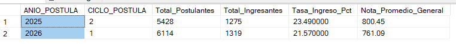
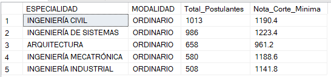
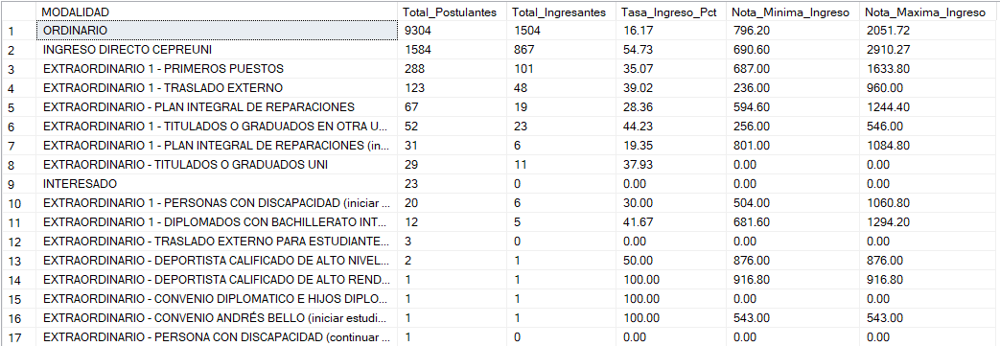
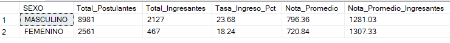
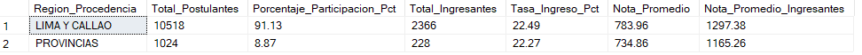
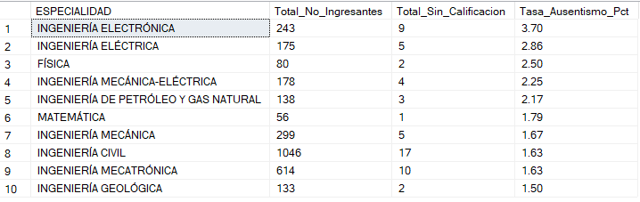
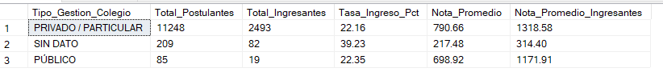
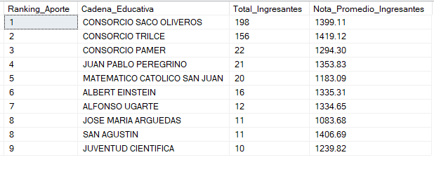
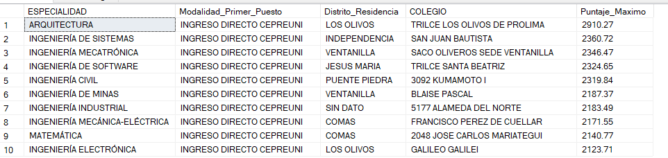
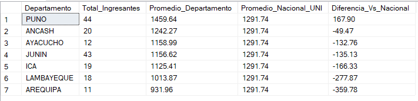

# SQL-SERVER-UNI-ADMISION-ANALYSIS
SQL-SERVER-UNI-ADMISION-ANALYSIS
## Contexto del Proyecto
En este proyecto se analizan los resultados del proceso de admisión a la Universidad Nacional de Ingeniería (UNI) para los periodos 2025-II y 2026-I. Utilizando la base oficial de [Datos Abiertos del Estado Peruano](https://www.datosabiertos.gob.pe/dataset/postulantes-al-concurso-de-admisi%C3%B3n-de-la-universidad-nacional-de-ingenier%C3%ADa-del-2025-2-al), se aplican consultas en SQL Server para limpiar la información y extraer insights clave mediante agregaciones, expresiones de tabla comunes (CTEs) y funciones de ventana.

El objetivo del estudio es evaluar cómo influyen variables como el colegio de procedencia, la modalidad de ingreso, el género y la ubicación geográfica en el rendimiento académico de los postulantes.

## Diccionario de Columnas

Los datos originales provienen de la Plataforma Nacional de Datos Abiertos y se encuentran consolidados en la tabla principal Postulantes_UNI. A continuacion, la descripción de las columnas analizadas:
- IDHASH: Identificador único y anonimizado del postulante.
- COLEGIO: Nombre de la institución educativa de procedencia.
- COLEGIO_DEPA / PROV / DIST: Departamento, provincia y distrito de ubicación del colegio.
- COLEGIO_ANIO_EGRESO: Año en el que el postulante finalizó la educación secundaria.
- ESPECIALIDAD: Carrera profesional a la que postula.
- ANIO_POSTULA / CICLO_POSTULA: Periodo del examen de admisión (ej. 2025 - 2).
- DOMICILIO_DEPA / PROV / DIST: Ubicación geográfica de residencia actual del postulante.
- ANIO_NACIMIENTO: Año de nacimiento del postulante.
- SEXO: Género del postulante.
- CALIF_FINAL: Calificación vigesimal u oficial obtenida en las pruebas de admisión.
- INGRESO: Estado final del postulante (INGRESÓ o NO INGRESÓ).
- MODALIDAD: Modalidad del concurso (Ordinario, Dos Primeros Alumnos, etc.).

## Limpieza de Datos

Antes de realizar el Análisis Exploratorio de Datos (EDA), se estandarizaron los datos nulos para preparar la información y procesarla correctamente.


``` SQL
UPDATE Postulantes_UNI
SET 
    COLEGIO = NULLIF(COLEGIO, 'SIN DATO'),
    COLEGIO_DEPA = NULLIF(COLEGIO_DEPA, 'SIN DATO'),
    COLEGIO_PROV = NULLIF(COLEGIO_PROV, 'SIN DATO'),
    COLEGIO_DIST = NULLIF(COLEGIO_DIST, 'SIN DATO'),
    DOMICILIO_DEPA = NULLIF(DOMICILIO_DEPA, 'SIN DATO'),
    DOMICILIO_PROV = NULLIF(DOMICILIO_PROV, 'SIN DATO'),
    DOMICILIO_DIST = NULLIF(DOMICILIO_DIST, 'SIN DATO')
WHERE 
    COLEGIO = 'SIN DATO' 
    OR COLEGIO_DEPA = 'SIN DATO' 
    OR COLEGIO_PROV = 'SIN DATO' 
    OR COLEGIO_DIST = 'SIN DATO'
    OR DOMICILIO_DEPA = 'SIN DATO' 
    OR DOMICILIO_PROV = 'SIN DATO' 
    OR DOMICILIO_DIST = 'SIN DATO';
```


## Exploratory Data Analysis: 10 Key Insights

### Pregunta 1: 
¿Cuál es el promedio general de calificación y la tasa de ingreso por proceso de admisión?
- Query:

``` SQL
SELECT 
    ANIO_POSTULA,
    CICLO_POSTULA,
    COUNT(*) AS Total_Postulantes,
    SUM(CASE WHEN INGRESO = 'SI' THEN 1 ELSE 0 END) AS Total_Ingresantes,
    ROUND(SUM(CASE WHEN INGRESO = 'SI' THEN 1.0 ELSE 0 END) * 100.0 / COUNT(*), 2) AS Tasa_Ingreso_Pct,
    ROUND(AVG(CALIF_FINAL), 2) AS Nota_Promedio_General
FROM Postulantes_UNI
GROUP BY ANIO_POSTULA, CICLO_POSTULA
ORDER BY ANIO_POSTULA, CICLO_POSTULA;
```

-  Resultado:

- Conclusión:  
El proceso 2026-1 registró un incremento de 686 postulantes respecto al ciclo anterior, lo que elevó la competencia y redujo la tasa de ingreso en cerca de 1.9 puntos porcentuales (de 23.49% a 21.57%). Asimismo, se observa una ligera disminución en el puntaje promedio general en el examen 2026-1.


### Pregunta 2: 
¿Cuáles son las 5 carreras con mayor demanda en el examen Ordinario y cuál es su respectiva nota de corte?

- Query:

``` SQL
SELECT TOP 5
    ESPECIALIDAD,
    MODALIDAD,
    COUNT(*) AS Total_Postulantes,
    -- Se evalúa la nota de corte en la modalidad ORDINARIO para reflejar el puntaje mínimo real del concurso regular
    ROUND(MIN(CASE WHEN INGRESO = 'SI' THEN CALIF_FINAL END), 2) AS Nota_Corte_Minima
FROM Postulantes_UNI
WHERE MODALIDAD = 'ORDINARIO'
GROUP BY ESPECIALIDAD, MODALIDAD
ORDER BY Total_Postulantes DESC;
```

- Resultado:

- Conclusión:  
En la modalidad Ordinario, Ingeniería Civil y Sistemas lideran la demanda de postulantes. Sin embargo, Ingeniería de Sistemas registra la nota de corte más exigente del Top 5 (1223.40 puntos), superando incluso a Civil (1190.40 puntos) a pesar de tener una cantidad ligeramente menor de candidatos.


### Pregunta 3: 
¿Cómo se distribuyen los postulantes, la tasa de ingreso y el rango de calificaciones (mínima y máxima) según la modalidad de admisión?
- Query:

``` SQL
SELECT 
    MODALIDAD,
    COUNT(*) AS Total_Postulantes,
    -- Conteo condicional para contabilizar únicamente a los postulantes que lograron ingresar
    SUM(CASE WHEN INGRESO = 'SI' THEN 1 ELSE 0 END) AS Total_Ingresantes,
    CAST(SUM(CASE WHEN INGRESO = 'SI' THEN 1.0 ELSE 0 END) * 100.0 / COUNT(*) AS DECIMAL(10,2)) AS Tasa_Ingreso_Pct,
    CAST(ISNULL(MIN(CASE WHEN INGRESO = 'SI' THEN CALIF_FINAL END), 0) AS DECIMAL(10,2)) AS Nota_Minima_Ingreso,
    CAST(ISNULL(MAX(CASE WHEN INGRESO = 'SI' THEN CALIF_FINAL END), 0) AS DECIMAL(10,2)) AS Nota_Maxima_Ingreso
FROM Postulantes_UNI
GROUP BY MODALIDAD
ORDER BY Total_Postulantes DESC;
```

- Resultado: 


- Conclusión:  
La modalidad Ordinario concentra la mayor cantidad de postulantes (9,304) pero registra la menor tasa de éxito (16.17%). En contraste, CEPREUNI es la vía más efectiva con un 54.73% de ingreso y el puntaje más alto del proceso (2910.27 puntos). Por último, las modalidades extraordinarias aplican criterios especiales, registrando un puntaje de 0.00 al no evaluarse mediante el examen tradicional.

### Pregunta 4: 
 ¿Existe una brecha de rendimiento en las calificaciones promedio y tasas de ingreso diferenciada por sexo?
- Query:

``` SQL
SELECT 
    SEXO,
    COUNT(*) AS Total_Postulantes,
    SUM(CASE WHEN INGRESO = 'SI' THEN 1 ELSE 0 END) AS Total_Ingresantes,
    -- Tasa de ingreso redondeada a 2 decimales
    CAST(SUM(CASE WHEN INGRESO = 'SI' THEN 1.0 ELSE 0 END) * 100.0 / COUNT(*) AS DECIMAL(10,2)) AS Tasa_Ingreso_Pct,
    -- Promedio de nota general
    CAST(AVG(CALIF_FINAL) AS DECIMAL(10,2)) AS Nota_Promedio,
    -- Promedio de nota considerando únicamente a quienes ingresaron
    CAST(AVG(CASE WHEN INGRESO = 'SI' THEN CALIF_FINAL END) AS DECIMAL(10,2)) AS Nota_Promedio_Ingresantes
FROM Postulantes_UNI
WHERE SEXO IS NOT NULL
GROUP BY SEXO
ORDER BY Total_Postulantes DESC;
```

- Resultado: 

- Conclusión:  
Existe una brecha de participación, donde el volumen de postulantes masculinos representa más del 77% del total. Si bien los hombres presentan una mayor tasa de ingreso (23.68% frente al 18.24%) y un promedio general ligeramente superior, las mujeres que logran ingresar obtienen un desempeño superior, alcanzando un promedio de 1307.33 puntos frente a los 1281.03 del grupo masculino.

### Pregunta 5: 
¿Existe una diferencia en el rendimiento y tasa de ingreso entre postulantes de Lima/Callao y los del resto del país?
- Query:

``` SQL
SELECT 
    CASE 
        WHEN DOMICILIO_DEPA IN ('LIMA', 'CALLAO') THEN 'LIMA Y CALLAO'
        ELSE 'PROVINCIAS'
    END AS Region_Procedencia,
    COUNT(*) AS Total_Postulantes,
    CAST(COUNT(*) * 100.0 / SUM(COUNT(*)) OVER() AS DECIMAL(10,2)) AS Porcentaje_Participacion_Pct,
    SUM(CASE WHEN INGRESO = 'SI' THEN 1 ELSE 0 END) AS Total_Ingresantes,
    CAST(SUM(CASE WHEN INGRESO = 'SI' THEN 1.0 ELSE 0 END) * 100.0 / COUNT(*) AS DECIMAL(10,2)) AS Tasa_Ingreso_Pct,
    CAST(AVG(CALIF_FINAL) AS DECIMAL(10,2)) AS Nota_Promedio,
    CAST(AVG(CASE WHEN INGRESO = 'SI' THEN CALIF_FINAL END) AS DECIMAL(10,2)) AS Nota_Promedio_Ingresantes
FROM Postulantes_UNI
GROUP BY 
    CASE 
        WHEN DOMICILIO_DEPA IN ('LIMA', 'CALLAO') THEN 'LIMA Y CALLAO'
        ELSE 'PROVINCIAS'
    END
ORDER BY Total_Postulantes DESC;
```

- Resultado: 

- Conclusión:  
Existe una marcada centralización en la postulación, ya que Lima y Callao concentran el 91.1% de los candidatos. Aunque ambas regiones muestran una tasa de ingreso prácticamente idéntica (~22.3%), los ingresantes procedentes de la capital alcanzan un rendimiento académico superior en el examen, superando por más de 132 puntos en promedio a los ingresantes de provincias (1297.38 vs 1165.26).

### Pregunta 6: 
¿Cuáles son las carreras con mayor tasa de ausentismo o descalificación (nota de 0 puntos) en el examen?
- Query:

``` SQL
SELECT TOP 10
    ESPECIALIDAD,
    COUNT(*) AS Total_No_Ingresantes,
    -- Contabiliza a los no ingresantes con calificación 0 o vacía (ausentes o descalificados)
    SUM(CASE WHEN CALIF_FINAL = 0 OR CALIF_FINAL IS NULL THEN 1 ELSE 0 END) AS Total_Sin_Calificacion,
    CAST(SUM(CASE WHEN CALIF_FINAL = 0 OR CALIF_FINAL IS NULL THEN 1.0 ELSE 0 END) * 100.0 / COUNT(*) AS DECIMAL(10,2)) AS Tasa_Ausentismo_Pct
FROM Postulantes_UNI
WHERE INGRESO = 'NO'
GROUP BY ESPECIALIDAD
HAVING COUNT(*) > 50 -- Filtro para garantizar relevancia estadística
ORDER BY Tasa_Ausentismo_Pct DESC;
```
- Resultado: 

- Conclusión:  
La tasa de ausentismo o descalificación técnica (nota 0.00) entre los postulantes que no ingresaron es sumamente baja en todas las especialidades, manteniéndose por debajo del 4%. Ingeniería Electrónica encabeza el grupo con un 3.70%, seguida de Ingeniería Eléctrica con 2.86%. Estos valores confirman una alta tasa de asistencia efectiva y compromiso por parte de los aspirantes en la fase de evaluación.

### Pregunta 7: 
¿El tipo de gestión del colegio (Público vs. Privado) influye en la tasa de ingreso y en el rendimiento académico?
- Query:

``` SQL
SELECT 
    CASE 
        WHEN COLEGIO LIKE '%ESTATAL%' OR COLEGIO LIKE '%NACIONAL%' OR COLEGIO LIKE '%I.E.%' THEN 'PÚBLICO'
        WHEN COLEGIO IS NULL THEN 'SIN DATO'
        ELSE 'PRIVADO / PARTICULAR'
    END AS Tipo_Gestion_Colegio,
    COUNT(*) AS Total_Postulantes,
    SUM(CASE WHEN INGRESO = 'SI' THEN 1 ELSE 0 END) AS Total_Ingresantes,
    CAST(SUM(CASE WHEN INGRESO = 'SI' THEN 1.0 ELSE 0 END) * 100.0 / COUNT(*) AS DECIMAL(10,2)) AS Tasa_Ingreso_Pct,
    CAST(AVG(CALIF_FINAL) AS DECIMAL(10,2)) AS Nota_Promedio,
    CAST(AVG(CASE WHEN INGRESO = 'SI' THEN CALIF_FINAL END) AS DECIMAL(10,2)) AS Nota_Promedio_Ingresantes
FROM Postulantes_UNI
GROUP BY 
    CASE 
        WHEN COLEGIO LIKE '%ESTATAL%' OR COLEGIO LIKE '%NACIONAL%' OR COLEGIO LIKE '%I.E.%' THEN 'PÚBLICO'
        WHEN COLEGIO IS NULL THEN 'SIN DATO'
        ELSE 'PRIVADO / PARTICULAR'
    END
ORDER BY Total_Postulantes DESC;
```
- Resultado: 

- Conclusión:  
Aunque la tasa de ingreso efectiva es casi idéntica entre ambos sectores (~22.2%), los ingresantes provenientes de colegios privados alcanzan un desempeño superior en el examen, superando en promedio por más de 146 puntos a los ingresantes de colegios públicos (1318.58 vs 1171.91). El grupo sin dato corresponde a modalidades de ingreso especial o directo con baja ponderación en el examen tradicional.

### Pregunta 8: 
Ranking de los 10 colegios específicos que más ingresantes aportan a la UNI
- Query:

``` SQL
WITH Agrupacion_Colegios AS (
    SELECT 
        CASE 
            WHEN COLEGIO LIKE '%TRILCE%' THEN 'CONSORCIO TRILCE'
            WHEN COLEGIO LIKE '%SACO OLIVEROS%' OR COLEGIO LIKE '%OLIVEROS%' THEN 'CONSORCIO SACO OLIVEROS'
            WHEN COLEGIO LIKE '%PAMO%PADUA%' OR COLEGIO LIKE '%PAMER%' THEN 'CONSORCIO PAMER'
            WHEN COLEGIO LIKE '%PEREGRINO%' THEN 'JUAN PABLO PEREGRINO'
            WHEN COLEGIO LIKE '%EINSTEIN%' THEN 'ALBERT EINSTEIN'
            ELSE COLEGIO
        END AS Cadena_Educativa,
        CALIF_FINAL
    FROM Postulantes_UNI
    WHERE INGRESO = 'SI' 
      AND COLEGIO IS NOT NULL
),
Ranking_Cadenas AS (
    SELECT 
        Cadena_Educativa,
        COUNT(*) AS Total_Ingresantes,
        CAST(AVG(CALIF_FINAL) AS DECIMAL(10,2)) AS Nota_Promedio_Ingresantes,
        DENSE_RANK() OVER (ORDER BY COUNT(*) DESC) AS Ranking_Aporte
    FROM Agrupacion_Colegios
    GROUP BY Cadena_Educativa
)
SELECT TOP 10 
    Ranking_Aporte,
    Cadena_Educativa,
    Total_Ingresantes,
    Nota_Promedio_Ingresantes
FROM Ranking_Cadenas
ORDER BY Ranking_Aporte ASC;
```
- Resultado: 

- Conclusión:  
Al consolidar las sedes fragmentadas en consorcios educativos, se evidencia un dominio abrumador del Consorcio Saco Oliveros (198 ingresantes) y el Consorcio Trilce (156 ingresantes), sumando entre ambos más del 14% del total de ingresantes. Asimismo, Trilce alcanza el promedio de calificación más alto del Top 3 con 1419.12 puntos.

### Pregunta 9: 
¿Quiénes obtuvieron el puntaje máximo por especialidad y de qué distrito y colegio provienen? (Uso de ROW_NUMBER)
- Query:

``` SQL
WITH Ranking_Postulantes AS (
    SELECT 
        ESPECIALIDAD,
        IDHASH,
        MODALIDAD,
        COLEGIO,
        DOMICILIO_DIST AS Distrito_Residencia,
        CALIF_FINAL,
        -- ROW_NUMBER asigna posición 1 al puntaje más alto de cada especialidad
        ROW_NUMBER() OVER (PARTITION BY ESPECIALIDAD ORDER BY CALIF_FINAL DESC) AS Posicion
    FROM Postulantes_UNI
    WHERE INGRESO = 'SI'
)
SELECT TOP 10
    ESPECIALIDAD,
    MODALIDAD AS Modalidad_Primer_Puesto,
    Distrito_Residencia,
    COLEGIO,
    CAST(CALIF_FINAL AS DECIMAL(10,2)) AS Puntaje_Maximo
FROM Ranking_Postulantes
WHERE Posicion = 1
ORDER BY CALIF_FINAL DESC;
```
- Resultado: 

- Conclusión:  
El 100% de los puntajes más altos por especialidad en este Top 10 ingresaron mediante la modalidad INGRESO DIRECTO CEPREUNI, lo que demuestra que el centro preuniversitario de la propia institución es la vía que prepara con mayor efectividad para alcanzar los puestos de cómputo general. Asimismo, se observa una fuerte presencia de estudiantes procedentes de distritos de Lima Norte (Los Olivos, Comas, Puente Piedra, Independencia) y Ventanilla.

### Pregunta 10: 
Descentralización del talento: ¿Qué departamentos (excluyendo Lima y Callao) aportan los ingresantes con mejor rendimiento sobre el promedio general?
- Query:

``` SQL
WITH Promedio_Nacional AS (
    SELECT AVG(CALIF_FINAL) AS Promedio_Global
    FROM Postulantes_UNI
    WHERE INGRESO = 'SI' AND CALIF_FINAL > 0
),
Rendimiento_Departamental AS (
    SELECT 
        DOMICILIO_DEPA AS Departamento,
        COUNT(*) AS Total_Ingresantes,
        AVG(CALIF_FINAL) AS Promedio_Departamento
    FROM Postulantes_UNI
    WHERE INGRESO = 'SI' 
      AND CALIF_FINAL > 0
      AND DOMICILIO_DEPA NOT IN ('LIMA', 'CALLAO', 'SIN DATO', 'DESCONOCIDO', '')
      AND DOMICILIO_DEPA IS NOT NULL
    GROUP BY DOMICILIO_DEPA
    HAVING COUNT(*) >= 10 
)
SELECT TOP 10
    r.Departamento,
    r.Total_Ingresantes,
    CAST(r.Promedio_Departamento AS DECIMAL(10,2)) AS Promedio_Departamento,
    CAST(p.Promedio_Global AS DECIMAL(10,2)) AS Promedio_Nacional_UNI,
    CAST(r.Promedio_Departamento - p.Promedio_Global AS DECIMAL(10,2)) AS Diferencia_Vs_Nacional
FROM Rendimiento_Departamental r
CROSS JOIN Promedio_Nacional p
ORDER BY Diferencia_Vs_Nacional DESC;
```
- Resultado: 

- Conclusión:  
Solo 7 departamentos de provincia logran aportar un volumen representativo de ingresantes (10 o más), lo que evidencia una fuerte centralización académica. De este grupo, Puno es una excepción absoluta: no solo lidera en cantidad de ingresantes junto a Junín, sino que es la única región del país que supera el promedio nacional (+167.90 puntos). Las demás regiones quedan por debajo de la media global, reflejando la persistente brecha de preparación frente a la capital.

## Conclusiones Generales

Tras el desarrollo de las 10 consultas del análisis exploratorio, se identificaron los siguientes hallazgos principales sobre el examen de admisión a la UNI:

- Saco Oliveros, Trilce y CEPREUNI concentran más del 14% de los ingresantes y obtienen el 100% de los primeros puestos por especialidad.

- Lima y Callao representan el 91.1% de los postulantes, mientras que Puno destaca como la única provincia que supera el promedio académico nacional con +167.90 puntos.

- Las mujeres ingresantes logran un promedio de calificación superior al del grupo masculino (1307.33 vs. 1281.03 puntos) a pesar de representar menos del 23% de las postulaciones.

- Ingeniería de Sistemas registra la nota de corte más alta (1223.40 puntos) entre las carreras de mayor demanda en la modalidad Ordinario.